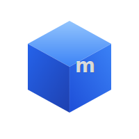

<p align="center">
  
</p>

<h1 align="center">miniblue</h1>

<p align="center"><strong>Local Azure development. One binary. No account needed.</strong></p>

miniblue is a free, open-source Azure emulator that runs entirely on your machine. Test your Azure apps locally without an Azure account, network connection, or credit card.

## Why miniblue?

Azure developers have to juggle 5+ separate emulators (Azurite, Cosmos DB Emulator, Functions Core Tools, etc.) just to get basic local dev working. miniblue replaces all of them with a single binary on a single port.

```bash
docker run -p 4566:4566 -p 4567:4567 moabukar/miniblue:latest
```

That's it. 25 Azure services are now running locally.

## What's included

| Service | Description |
|---------|-------------|
| Resource Groups | ARM resource group management |
| Blob Storage | Containers, blobs, upload/download |
| Table Storage | Entity CRUD operations |
| Queue Storage | Send/receive/peek messages |
| Key Vault | Secrets management |
| Cosmos DB | Document CRUD (SQL API) |
| Service Bus | Queues, topics, messaging |
| Azure Functions | Function app registration |
| Virtual Networks | VNets and subnets |
| DNS Zones | Zone and record management |
| Container Registry | Registry management |
| Event Grid | Topics and event publishing |
| App Configuration | Key-value configuration store |
| Managed Identity | IMDS token endpoint |
| DB for PostgreSQL | Flexible server + database management |
| DB for MySQL | Flexible server + database management |
| Azure SQL Database | Server + database management |
| Azure Cache for Redis | Cache management + key listing |
| Container Instances | Container group lifecycle |
| Public IP Addresses | Static/dynamic IP allocation |
| Network Security Groups | NSGs with security rules |
| Load Balancer | Frontend IPs, backend pools, rules, probes |
| Application Gateway | L7 load balancing, WAF, routing rules |

## Works with your tools

- **Terraform** - `metadata_host = "localhost:4567"` and you're done
- **azlocal CLI** - like `awslocal` for LocalStack
- **Azure CLI** - custom cloud registration
- **Any Azure SDK** - just point the endpoint to `http://localhost:4566`
- **curl** - standard REST API

## Quick start

```bash
# Install
go install github.com/moabukar/miniblue/cmd/miniblue@latest

# Or use Docker
docker run -p 4566:4566 -p 4567:4567 moabukar/miniblue:latest

# Create a resource group
curl -X PUT "http://localhost:4566/subscriptions/sub1/resourcegroups/myRG?api-version=2020-06-01" \
  -H "Content-Type: application/json" \
  -d '{"location": "eastus"}'
```

[Get started →](getting-started/installation.md)
